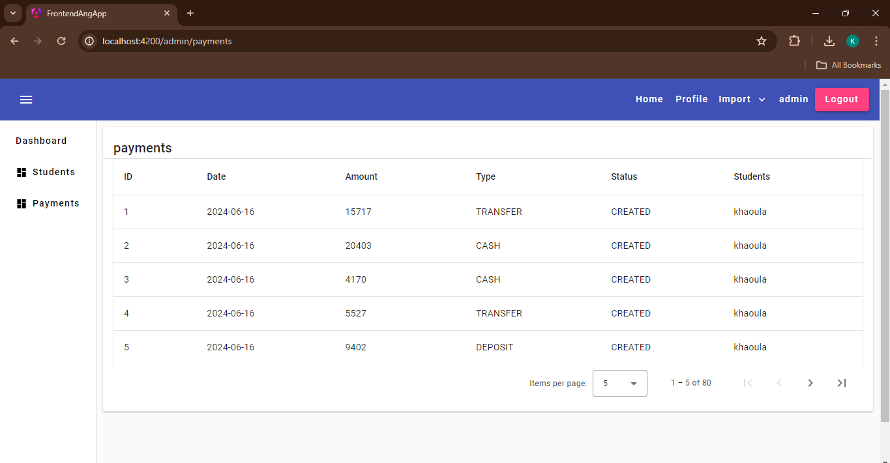
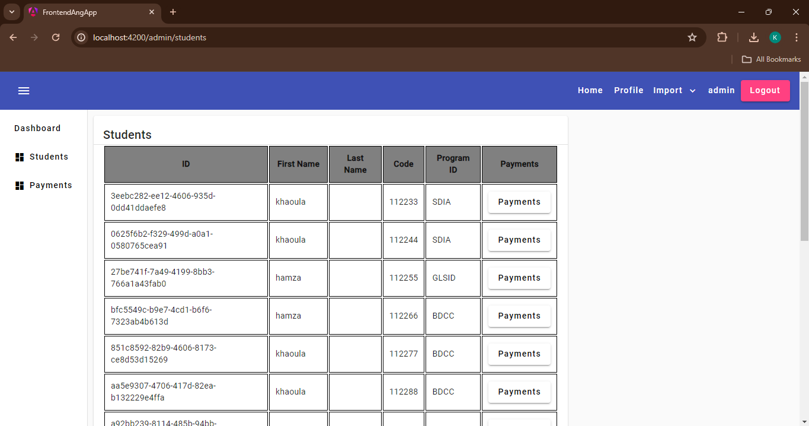
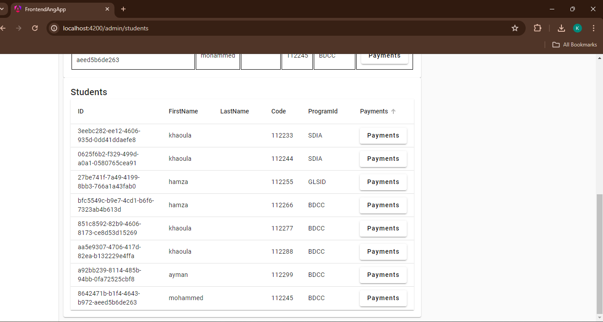
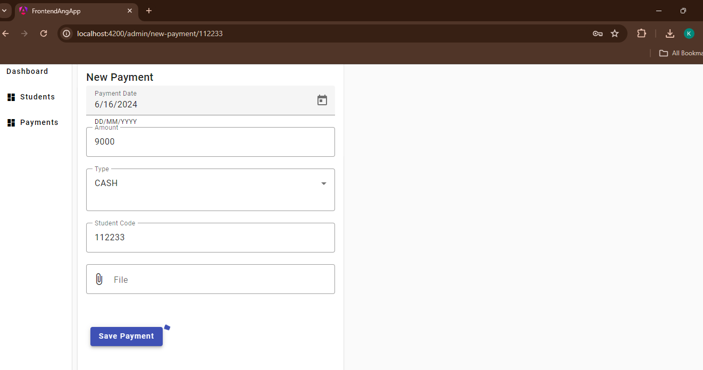
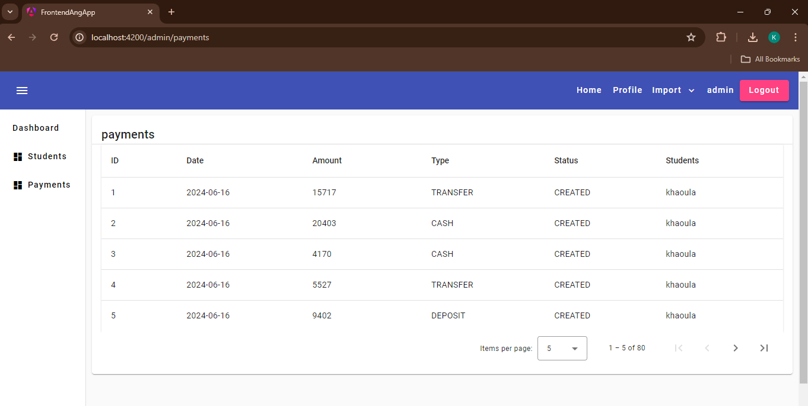
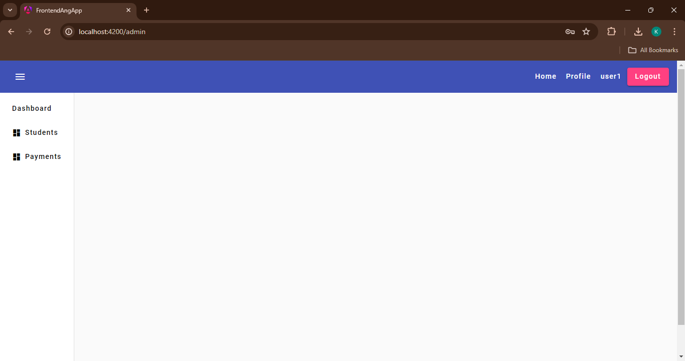

Objectif :  

 Développer une application qui permet de gérer le payement des étudiants. Chaque étudiants peut effectuer plusieurs payements
- Chaque étudiant est défini par son : id, firstName, lastName, email, sa filière, sa photo,
- Chaque Payement est défini par son id, son code, sa date, son type (CASH, CHECK,TRANSFER), son status (CREATED, VALIDATED, REJECTED), file (fichier pdf représentant le reçu de payement)

<h3> Côté Admin </h3>

<h3>list des payments des étudiants</h3>

<h3>creation des nouveaux payments  </h3>

<h3>Liste des payments <h3>

<h3>Côté User </h3>
